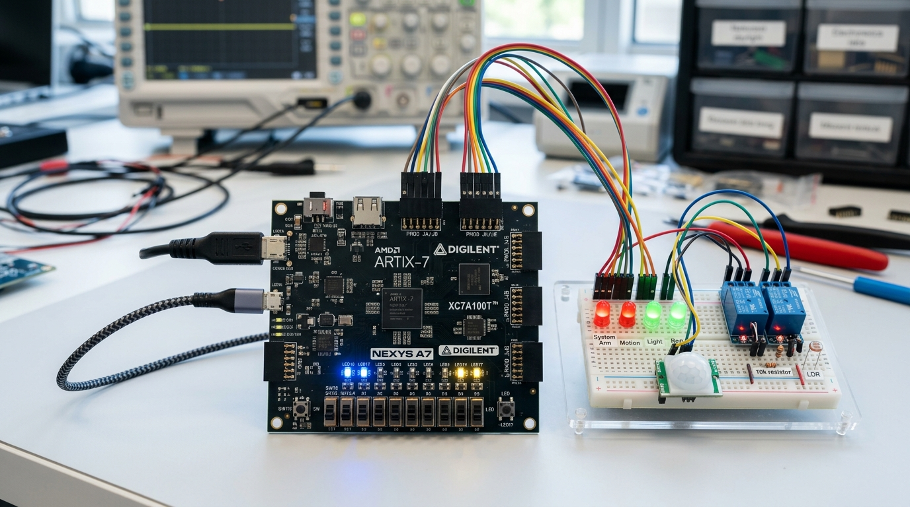
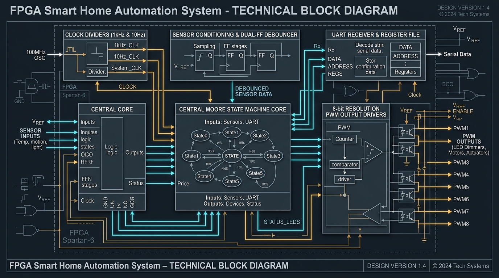

# FPGA-Based Smart Home Automation & Electrical Safety Controller

[](https://en.wikipedia.org/wiki/Verilog)
[](https://www.xilinx.com/products/silicon-devices/fpga/artix-7.html)
[](http://iverilog.icarus.com/)
[](LICENSE)

An industrial-grade, ultra-reliable, hard-real-time Smart Home Automation and electrical safety monitoring system fully implemented in **synthesizable Verilog HDL**. Designed for high-reliability embedded applications, this project leverages FPGA hardware level concurrency to bypass the non-deterministic latencies, stack crashes, and serial execution bottlenecks typical in microcontroller setups (e.g., Arduino, ESP32). Under critical safety faults—such as power grid overcurrent—this controller delivers a sub-microsecond hardware-isolated trip response.

---

## 📸 Project Hardware Showcase

Below is the experimental hardware verification layout modeling the system deployed on an Artix-7 board:



---

## 🛠️ Folder & Directory Structure Explanations

To ensure compliance with standard corporate FPGA workflows (Xilinx Vivado, Intel Quartus, and open-source toolchains), this project is organized into self-contained directory grids:

```
Smart-Home-Automation-FPGA/
│
├── rtl/                   # Synthesizable RTL (Register Transfer Level) Verilog source files
├── tb/                    # Verification testbenches and automated test vectors
├── constraints/           # Physical board configuration and physical pin mappings
├── simulation/            # Compilers, synthesis optimization files, and gate-level scripts
├── waveforms/             # Simulation trace outputs and wave files (VCD/WDB)
├── reports/               # Synthesizer performance logs containing timing slack and power reports
├── images/                # Technical block diagrams, charts, and hardware setup logs
└── docs/                  # Technical references, datasheets, and user manual guides
```

### Detailed Breakdown of Each Folder:

*   **`rtl/` (Register Transfer Level Code)**: This is the heartbeat of the project. It houses the synthesizable Verilog source code files. Each hardware module is decoupled and models a specific logical peripheral. Modules include:
    *   `clk_en.v`: High-performance clock-enable tick generator converting a global master frequency down to synchronous strobes.
    *   `debounce.v`: Metasability filter and count-integrating debouncer protecting against noisy mechanical switches.
    *   `ctrl_fsm.v`: Central multi-priority controller implementing a Moore-type state manager.
    *   `scenes.v`: LUT decoder translating environmental presets (Evening, Party, Eco Saving) on demand.
    *   `pwm8.v`: Standard 8-bit frequency-modulated pulse width driver with 256 steps of intensity.
    *   `uart_rx.v`: High-speed 16x oversampled physical serial receiver.
    *   `top.v`: Structural wire binding file connecting all ports, submodules, and I/O pins together.
*   **`tb/` (Verification & Stimulus)**: Contains the test files used to verify design logic without physical hardware. The file `home_tb.v` is an automated, self-checking simulation testbench that exposes the FPGA code to realistic environmental transitions (motion detection, brown-out surges, switches, and override signals) and asserts outputs are deterministic.
*   **`constraints/` (Pin Assignments & Timing Constraints)**: Houses the official Xilinx Design Constraints (`constraints.xdc`) mapping of ports to physical pins on the AMD/Xilinx Artix-7 Nexys A7 development board. This includes clock configurations, pull-up/pull-down requirements, logic standard definitions (`LVCMOS33`), and maximum clock period parameters.
*   **`simulation/` (Gates & Netlist Mapping)**: Contains compiler configurations and Yosys open-source scripts to check netlist structures, flatten optimization hierarchies, and verify logic synthesis without vendor-specific code blocks.
*   **`waveforms/` (Trace Analyzer Dumps)**: Holds the digital wave-tracing dumps (such as `.vcd` or `.wdb` files). Developers can import these trace dumps directly into GTKWave or Vivado Waveform Viewer to inspect intermediate wires at nanosecond precision.
*   **`reports/` (Timing & Utilization Reports)**: Houses structural logs explaining physical slice usage (LUTs, Flip-Flops, DSP lines), thermal power metrics, and setup/hold timing slack analysis. It confirms that the system has met closed timing constraints.
*   **`images/` (Visual & Technical Graphics)**: Stores professional diagrams, block schematics, FSM state webs, and laboratory prototype photos to keep documentation high-contrast and easy to digest.
*   **`docs/` (Sensor Manuals & Guides)**: Comprises pin configurations, sensor data sheets (e.g., PIR and LDR sensor details), magnetic relay models, and board guides to assist in hardware assembly.

---

## 🧭 Hardware Block Architecture

The simplified structural interconnect within the FPGA top module is diagrammed below:



---

## 🚦 Operational Modes and Logic Priority

The central Moore FSM monitors and prioritizes processes dynamically. Safety rules always block lower-tier convenience modes:

| Mode Status | State Name | Port Conditions | Logic Priority | Electrical Overrides Applied | Actuators Switched |
| :--- | :--- | :--- | :--- | :--- | :--- |
| **FATAL SURGE** | `S_ALARM` | `overcur == 1` OR (`security_armed & door_open`) | **1 (Highest Priority)** | Instantly isolates mains socket lines to prevent fires. Activates localized alert sirens. | Sockets: ISOLATED, Sirens: ACTIVATED, Fans: OFF |
| **INTERACTIVE** | `S_MANUAL` | Manual button toggle OR ESP32 UART packet | **2** | Loads direct switch-board override presets or custom software registers. | Mapped to Preset LUT or UART Data Block |
| **DYNAMIC** | `S_AUTO` | `pir == 1` AND `dark == 1` | **3** | Commences auto-lighting and sets a 60-second cooldown period. | Hallway Light: Active Soft-Bright, Fan: Mid |
| **DEFAULT** | `S_SCHEDULE`| Automatic clock trigger | **4 (Lowest Priority)** | Follows background scheduled presets (e.g., Night Safety pathing). | Low-intensity evening dimmers |

### State Transition Web

```
                         +-----------------------------+
                         |                             |
                         |           +-------------+   |  [overcur == 1]
                         |           |   RESET    |   |  [security_armed & door_open]
                         |           +-------------+   |
                         |                  |          |
                         v                  v          v
                 +---------------------------------------------+
                 |                 S_ALARM                     |
                 +---------------------------------------------+
                        |                             ^
                        | [overcur == 0 &&           | [overcur == 1]
                        |  security_cleared &&        | [security_armed & door_open]
                        |  manual_evt == 1]           |
                        v                             |
          +--------------------> +-------------------------+ <-------------------+
          |                      |        S_MANUAL         |                        |
          |                      +-------------------------+                        |
          |                        /                     \                          |
          |        [pir & dark && /                       \ [sched_valid &&         |
          |         !manual_evt] /                         \ !manual_evt]           |
          |                     v                           v                       |
   [manual_evt ||        +------------+               +------------+         [manual_evt ||
    uart_cmd_stb]        |   S_AUTO   | ------------> | S_SCHEDULE |          uart_cmd_stb]
          |              +------------+  [idle_cnt==0 &+------------+               |
          |                    ^         !pir]              |                       |
          |                    |                            |                       |
          |                    +----------------------------+                       |
          |                              [pir & dark]                               |
          +-------------------------------------------------------------------------+
```

---

## 📈 Timing Charts & Signal Waves

These timing graphics illustrate key simulation scenarios compiled during verification:

### 1. Synchronizer & Switch Debouncing
Mechanical sliding buttons exhibit bounce spikes. The inputs are synchronized and integrated across multi-cycle clocks to prevent logic stutter:

```
                  _   _       _     __________________________________________
async_in     ____| |_| |_____| |___|
                        ________________________
s2 (Sync)    __________|                        \_____________________________
                                                   :<- debounce delay (CNT=5) ->:
                                                   +----------------------------+
level (Out)  ______________________________________|                            |_____
                                                   _
rise_pulse   ____________________________________||___________________________________
```

### 2. Overcurrent Quick-Trip Response
In the event of an electrical safety fault, the isolated hardware triggers shutdown signals within <20 nanoseconds, bypassing scheduling tasks:

```
                                               * CRITICAL OVERCURRENT SURGE
                                               |
                                               v
overcur_raw   _________________________________+=====================================
                                               :<- Tripping Latency (< 20ns) :
state_ind     [----------- S_MANUAL (00) ----------|------------ S_ALARM (11) --------
              _________________________________
relays_out    _________________________________|\____________________________________ (Mains relays isolated)
                                               :
L0_PWM (Dim)  ========= Mapped Dim Level =======|\____________________________________ (Dimmer cut-off)
                                               :
alarm_buzzer  _________________________________+===================================== (Local alarm high)
```

---

## 💻 Synthesis & Compilation Pipeline

### A. Professional AMD/Xilinx Vivado (GUI Flow)
1. Launch **Vivado IDE** and select *Create Project*.
2. Tag your target FPGA board as `xc7a100tcsg324-1` (Nexys A7-100T) or `xc7a50tcsg324-1`.
3. Add Verilog source files located in the `rtl/` directory. Set `top.v` as the Top module block.
4. Add verification files from the `tb/` directory as simulation sources.
5. Add the physical board interface constraints from `constraints/constraints.xdc`.
6. Click **Generate Bitstream** in the main navigator to run Synthesis, Implementation, Place & Route, and compile binary file `top.bit`.
7. Program your Artix-7 board via USB in Hardware Manager.

### B. Open-Source Toolchain (CLI Flow)
For fast, terminal-based simulation and verification, ensure you have **Icarus Verilog**, **Yosys**, and **GTKWave** installed:

```bash
# 1. Compile the hardware modules alongside automated testbench vectors
iverilog -o home_simulation tb/home_tb.v rtl/*.v

# 2. Run simulation and dump raw timing logs
vvp home_simulation

# 3. Open GTKWave to visually verify nanosecond trace lines
gtkwave home_tb.vcd &

# 4. Run RTL-to-gate level synthesis using the Yosys command shell
yosys -s simulation/synth.ys
```

---

## 📡 Remote Control Protocol (UART ESP32 Bridge)

The board can interface with an external network adapter (ESP32, Raspberry Pi, or Bluetooth serial bridge) to synchronize with home platforms (Alexa, Home Assistant) via 115200 Baud, 8-N-1 settings. Commands consist of a 2-byte frame structure:

| Frame Byte | Segment | Bit Width | Description / Allowed Decodings |
| :--- | :--- | :--- | :--- |
| **Byte 1** | *Header Control* | `[7:4]` (Zero Padding)<br>`[3]` Strobe (Must be 1)<br>`[2:0]` Target Address | Address indices:<br>`1`..`4` - Direct Brightness Light registers (0..3)<br>`5`, `6` - Dedicated Cool Fan speed registers (0, 1)<br>`7` - Direct Solid State Relay digital mask override |
| **Byte 2** | *Raw Parameter* | `[7:0]` Unsigned Payload | Value: `0` (Fully OFF) to `255` (Fully Active max speed/dimming).<br>*(For Relay Index `7`, bits `[3:0]` map directly to Socket outputs)* |

---

## 📄 License & Collaboration

This system controller is released under the **MIT License**. Contributions, optimization forks, or sensor adapter board expansions (e.g., SPI screen boards) are welcome. Feel free to open a pull request!
